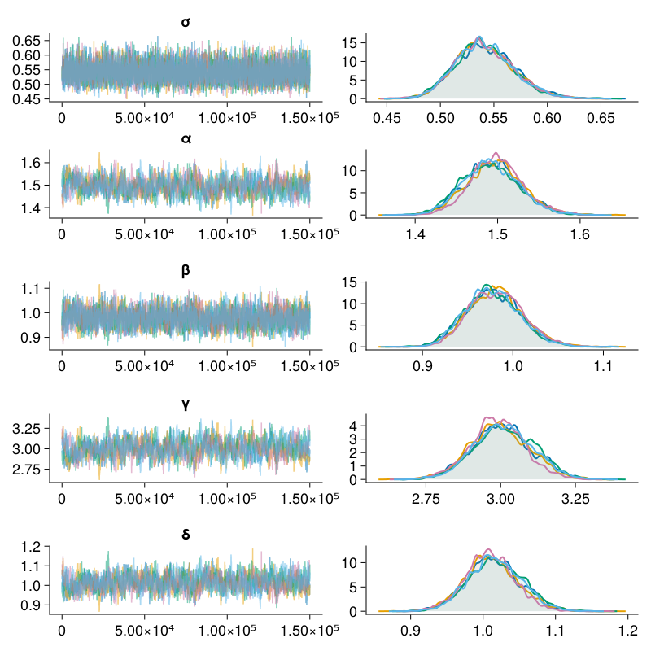
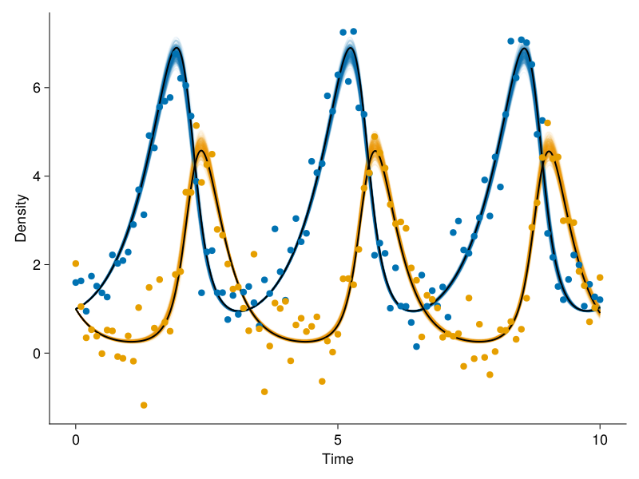

# Markov chain Monte Carlo methods

1. [Random Walk Metropolis](md/random_walk_metropolis.md) of unkown σ and μ of a Normal distribution

 
 
 
 

2. [ODE-Metropolis script](md/metropolis_ode.md) for inference of unkown parameter values of a Lotka-Volterra ODE-system

 
 
 
