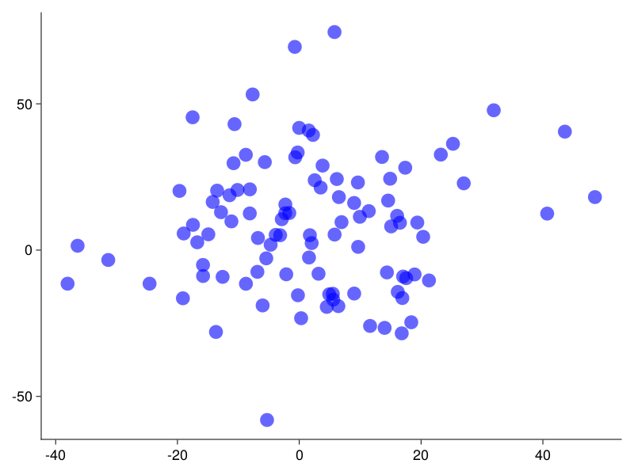
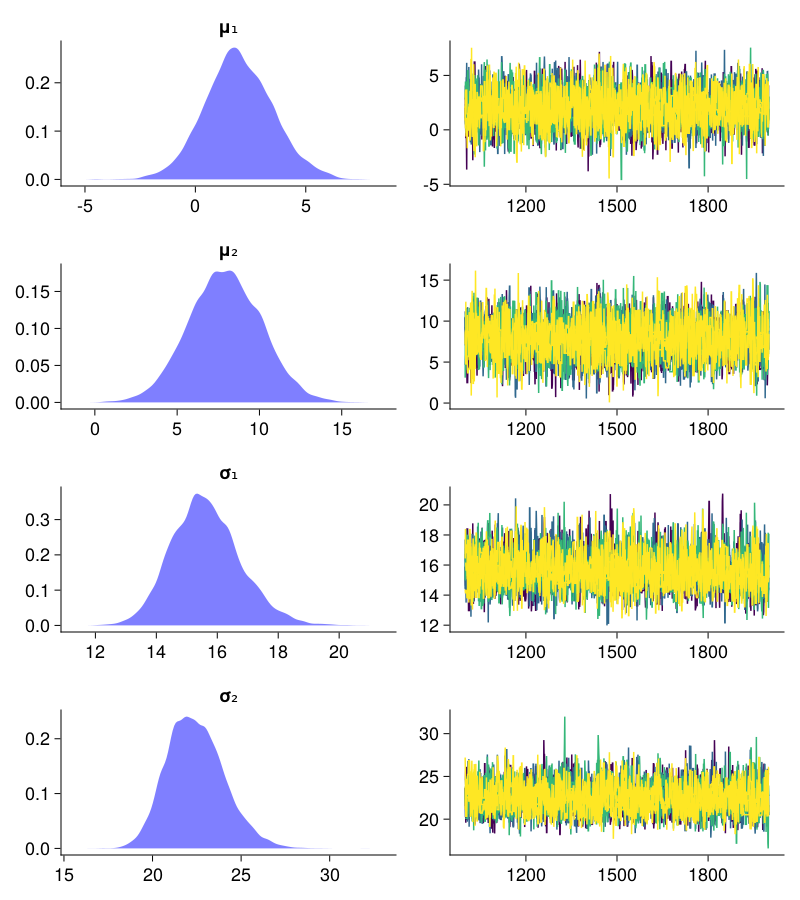

# Differential Evolution MCMC (DE)

This is an implementation of the Differential Evolution MCMC algorithm and, it is based on:

Braak, C.J.F.T. A Markov Chain Monte Carlo version of the genetic algorithm Differential Evolution: easy Bayesian computing for real parameter spaces. Stat Comput 16, 239–249 (2006). https://doi.org/10.1007/s11222-006-8769-1

The algorithm is a MCMC algorithm that uses a population of chains to explore the parameter space. There is no need to tune the proposal distribution and no gradients of the posterior density are calculated to generate new proposals.

Loading packages

````julia
using CairoMakie
using Distributions
using DimensionalData
using LinearAlgebra
import Random
````

Generate some data from a multivariate normal distribution without correlations

The following four parameters needs to be estimated: μ₁, μ₂, σ₁, σ₂ n

````julia
Random.seed!(1234)
μ = [3.0, 10.0]
σ = [15.0, 20.0]
real_dist = MvNormal(μ, σ)
empirical_data = rand(real_dist, 200)
fig, ax = scatter(empirical_data[1, :], empirical_data[2, :]; color = (:blue, 0.6), markersize = 25)
save("img/DE_data.png", fig)
````



A function to sample from the prior distributions

````julia
function prior_sample!(x, prior_dists)
    for i in eachindex(prior_dists)
        x[i] = rand(prior_dists[i])
    end
    return nothing
end
````

Calculate the unnormalized posterior ("fitness") $\rightarrow$ prior + likelihood:

````julia
function unnormalized_posterior(x, data, prior_dists)
    μ₁, μ₂, σ₁, σ₂ = x

    # -------- prior
    if σ₁ < 0 || σ₂ < 0
        return -Inf
    end

    prior = 0.0
    for i in eachindex(prior_dists)
        prior += logpdf(prior_dists[i], x[i])
    end

    # -------- likelihood
    dist = MvNormal([μ₁, μ₂], [σ₁, σ₂])
    ll = 0.0
    for i in axes(data, 2)
        z = @view data[:, i]
        ll += logpdf(dist, z)
    end
    return prior + ll
end
````

Function to run the differential evolution MCMC algorithm

````julia
function DE_MCMC(; external_chains = 4, draws = 2000,
                   d = 4, N = 3*d,
                   γ = 2.38 / sqrt(2*d), b = 1e-4)

    prior_dists = [Normal(0, 10), Normal(0, 10),
                   InverseGamma(2, 3), InverseGamma(2, 3)]
    xₚ = zeros(d)
    X = zeros(N, d)
    Y = zeros(external_chains, N, d, draws)

    for ext_n in 1:external_chains

        # -------- initial population from prior
        for i in axes(X, 1)
            z = @view X[i, :]
            prior_sample!(z, prior_dists)
        end

        # -------- MCMC
        for draw in 1:draws
            for i in 1:N
                # -------- sample r1, r2 from 1:N without i
                r1 = rand(1:N)
                r2 = rand(1:N)

                while true
                    if i != r1 && i != r2 && r1 != r2
                        break
                    end
                    r1 = rand(1:N)
                    r2 = rand(1:N)
                end

                # -------- proposal
                for j in 1:d
                    e = rand(Normal(0, b))
                    xₚ[j] = X[i, j] + γ * (X[r1, j] - X[r2, j]) + e
                end

                prop = unnormalized_posterior(xₚ, empirical_data, prior_dists)
                old = unnormalized_posterior(X[i, :], empirical_data, prior_dists)
                r = prop - old

                # -------- accept or reject
                if log(rand()) < min(r, 1)
                    X[i, :] .= xₚ
                end
            end

            Y[ext_n, :, :, draw] .= X
        end
    end

    Y_dim = DimArray(Y, (chain = 1:size(Y, 1),
                         internal_chain = 1:size(Y, 2),
                         parameter = [:μ₁, :μ₂, :σ₁, :σ₂],
                         draw = 1:size(Y, 4));)

    return Y_dim
end
````

Plotting function

````julia
own_theme = Theme(
    fontsize=18,
    Axis=(xgridvisible=false, ygridvisible=false,
          topspinevisible=false, rightspinevisible=false),
)
set_theme!(own_theme)

function plot_mcmc(mcmc_obj, path)
    @show start_covergence = size(mcmc_obj, :draw) ÷ 2
    thin = 1
    @show sample_x = start_covergence:thin:size(mcmc_obj, :draw)
    samples = mcmc_obj[draw = sample_x]

    names = ["μ₁", "μ₂", "σ₁", "σ₂"]
    fig = Figure(; resolution = (800, 900))

    for p in axes(samples, :parameter)

        Axis(fig[p,1]; title = names[p])
        density!(vec(samples[parameter = p]); color = (:blue, 0.5))

        Axis(fig[p,2])

        for ext_n in axes(samples, :chain)
            for i in axes(samples, :internal_chain)
                selected_samples = vec(samples[chain = ext_n, internal_chain = i, parameter = p])

                lines!(sample_x, vec(selected_samples);
                    colormap = :viridis,
                    color = ext_n, colorrange = (1, size(samples, 1)))
            end
        end
    end
    save(path, fig)

    fig
end
````

Run the algorithm

````julia
Y = DE_MCMC(; external_chains = 4, draws = 2000);
plot_mcmc(Y, "img/DE.png")
````

**Results:**

The different colours in the trace plots represent the different (external) chains. For each chain, several internal chains were simulated and plotted here in the same colour.


## Differential Evolution MCMC with fewer internal chains (DEz)

The algorithm can be run with fewer internal chains. This is useful when the dimension of the parameter space is large. Three internal chains are usually enough in comparison to to two time the dimension of the parameter space for the original algorithm.

This implementation is based on, but does not use the snooker update:

ter Braak, C.J.F., Vrugt, J.A. Differential Evolution Markov Chain with snooker updater and fewer chains. Stat Comput 18, 435–446 (2008). https://doi.org/10.1007/s11222-008-9104-9

````julia
function DEz_MCMC(; external_chains = 4,
                  draws = 2000,
                  d = 4, N = 3,
                  γ = 2.38 / sqrt(2), b = 1e-4,
                  K = 10, M₀ = 10*d)

    prior_dists = [Normal(0, 10), Normal(0, 10),
    InverseGamma(2, 3), InverseGamma(2, 3)]

    @assert M₀ > max(d, N)

    Y = DimArray(zeros(external_chains, draws, N, d),
    (chain = 1:external_chains,
        draw = 1:draws,
        internal_chain = 1:N,
        parameter = [:μ₁, :μ₂, :σ₁, :σ₂]);)

    Z = DimArray(zeros(M₀+draws*N, d),
                 (draw = 1:M₀+draws*N, parameter = [:μ₁, :μ₂, :σ₁, :σ₂]);)
    X = zeros(N, d)
    xₚ = zeros(d)

    for ext_n in 1:external_chains

        for i in 1:M₀
            z = @view Z[i, :]
            prior_sample!(z, prior_dists)
        end

        X .= Z[1:N, :]
        M = M₀

        for draw in 1:draws
            for _ in 1:K
                for i in 1:N
                    # -------- sample r1, r2 from 1:M without i
                    r1 = rand(1:M)
                    r2 = rand(1:M)

                    while true
                        if i != r1 && i != r2 && r1 != r2
                            break
                        end
                        r1 = rand(1:M)
                        r2 = rand(1:M)
                    end

                    # -------- proposal
                    for j in 1:d
                        e = rand(Normal(0, b))
                        xₚ[j] = X[i, j] + γ * (Z[r1, j] - Z[r2, j]) + e
                    end

                    prop = unnormalized_posterior(xₚ, empirical_data, prior_dists)
                    old = unnormalized_posterior(X[i, :], empirical_data, prior_dists)
                    r = prop - old

                    # -------- accept or reject
                    if log(rand()) < min(r, 1)
                        X[i, :] .= xₚ
                    end
                end ## internal chains
            end ## K

            Z[draw = M+1 .. M+N] = X
            M += N
            Y[chain = ext_n, draw = draw] .= X

        end
    end ## external_chains

    return Y
end

Yz = DEz_MCMC();
plot_mcmc(Yz, "img/DEz.png")
````

**Results:**



````julia
# to generate the Markdown file from the script:
# import Literate; Literate.markdown("src/DE.jl", "md/"; flavor=Literate.CommonMarkFlavor(), execute=false)
````

---

*This page was generated using [Literate.jl](https://github.com/fredrikekre/Literate.jl).*

