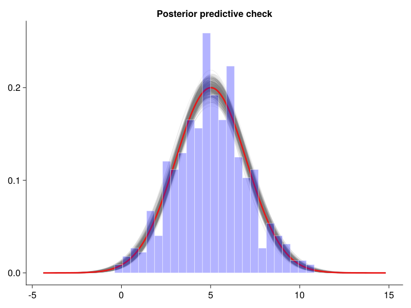

# Random walk Metropolis

$$
\begin{align}
        &p(θ | data) \propto p(data | θ) \cdot p(θ) \\
        &r_{M} = min\left(1,  \frac{p(θ_{t+1} | data)}{p(θ_{t} | data)}\right)
\end{align}
$$

**Setup:**

````julia
using Distributions, Statistics, LinearAlgebra
using CairoMakie

own_theme = Theme(
    fontsize=18,
    Axis=(xgridvisible=false, ygridvisible=false,
          topspinevisible=false, rightspinevisible=false),
)
set_theme!(own_theme)
````

**Example: unknown σ and μ**

````julia
let
    μ, σ = 5, 2

    propσ = [0.01, 0.001]

    y = rand(Normal(μ, σ), 500)
    @show median(y)
    @show std(y)

    prior_μ = truncated(Normal(0, 3), -10, 10)
    prior_σ = truncated(Normal(0, 1), 0, 10)

    function posterior(θ)

        # prior
        prior = logpdf(prior_μ, θ[1])
        prior += logpdf(prior_σ, θ[2])
        if prior == -Inf
            return -Inf
        end

        # likelihood
        likelihood = 0
        for i in eachindex(y)
            likelihood += logpdf(Normal(θ[1], θ[2]), y[i])
        end

        # unnormalized posterior
        p = likelihood + prior

        return p
    end

    nsamples = 5000
    nchains = 6
    nparameter = 2
    accepted_θ = zeros(nchains, nparameter, nsamples)
    accepted = zeros(nchains)
    θ = zeros(nparameter)

    for n in 1:nchains
        θ[1] = rand(prior_μ)
        θ[2] = rand(prior_σ)
        post = posterior(θ)

        for k in 1:nsamples

            # new proposal
            proposal_dist = MvNormal(θ, Diagonal(propσ))
            θstar = rand(proposal_dist)

            # evaluate prior + likelihood
            poststar = posterior(θstar)

            # M-H ratio
            ratio = poststar - post

            if log(rand()) < min(ratio, 1)
                accepted[n] += 1
                θ = θstar
                post = poststar
            end

            accepted_θ[n, :, k] = θ
        end
    end

    burnin = Int(2/4 *nsamples)
    median_μ = median(accepted_θ[:, 1, burnin:end])
    median_σ = median(accepted_θ[:, 2, burnin:end])

    @show accepted / nsamples
    @show median_μ
    @show median_σ

    # trace plot and density of parameters
    begin
        fig = Figure()

        titles = ["μ", "σ"]
        for i in 1:2
            Axis(fig[i,1]; title = titles[i])

            for n in 1:nchains
                lines!((burnin:nsamples) .- burnin, accepted_θ[n, i, burnin:end];
                    color=(Makie.wong_colors()[n], 0.5))
            end

            Axis(fig[i,2])
            for n in 1:nchains
                density!(accepted_θ[n, i, burnin:end];
                        bins=20,
                        color= (Makie.wong_colors()[n], 0.1),
                        strokecolor = (Makie.wong_colors()[n], 1),
                        strokewidth = 2, strokearound = false)
            end

        end
        rowgap!(fig.layout, 1, 5)
        save("img/trace_unknown_sigma_mu.png", fig);
    end

    # posterior predictive check
    begin
        fig = Figure()

        Axis(fig[1,1];
             title="Posterior predictive check")


        μs = vec(accepted_θ[:, 1, burnin:end])
        σs = vec(accepted_θ[:, 2, burnin:end])

        npredsamples = 500
        ns = sample(1:length(μs), npredsamples;
                    replace=false)

        minx, maxx = minimum(y)-4, maximum(y)+4
        nxvals = 200
        xvals = LinRange(minx, maxx, nxvals)
        pred = zeros(npredsamples, nxvals)

        # calculate and plot each predictive sample
        for i in eachindex(ns)
            μ = μs[ns[i]]
            σ = σs[ns[i]]
            post_dist = Normal(μ,σ)

            yvals = pdf.(post_dist, xvals)
            pred[i, :] = yvals

            lines!(xvals, yvals;
                   color=(:grey, 0.1))
        end

        # mean of the predicted densities
        meany = vec(mean(pred, dims=1))
        lines!(xvals, meany;
               linewidth=3,
               color=(:red, 0.8))

        # histogram of the data
        hist!(y;
            normalization=:pdf,
            bins=25,
            color=(:blue, 0.3),
            strokecolor=(:white, 0.5),
            strokewidth=1)

        save("img/pred_unknown_sigma_mu.png", fig);
    end

    nothing
end
````

````
median(y) = 5.153871190262614
std(y) = 1.9924000117938518
accepted / nsamples = [0.6072, 0.608, 0.6124, 0.6092, 0.6138, 0.615]
median_μ = 5.0212679190233045
median_σ = 1.9852937885924116

````

Trace plot and densities of the MCMC samples:

Posterior predictive check (mean in red):


````julia
# Literate.markdown("src/random_walk_metropolis.jl"; flavor = Literate.CommonMarkFlavor(), execute=false)
````

---

*This page was generated using [Literate.jl](https://github.com/fredrikekre/Literate.jl).*

